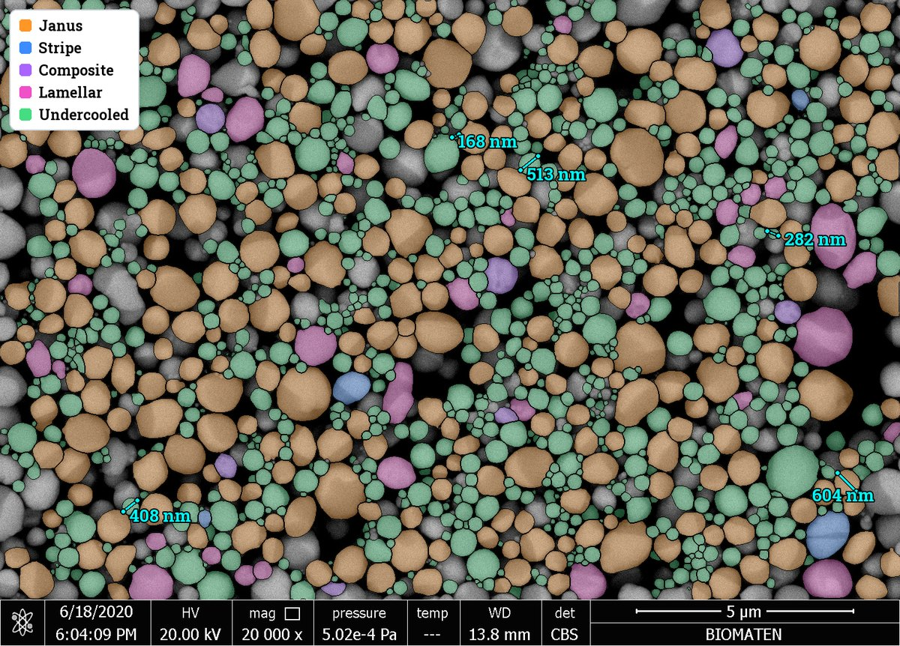
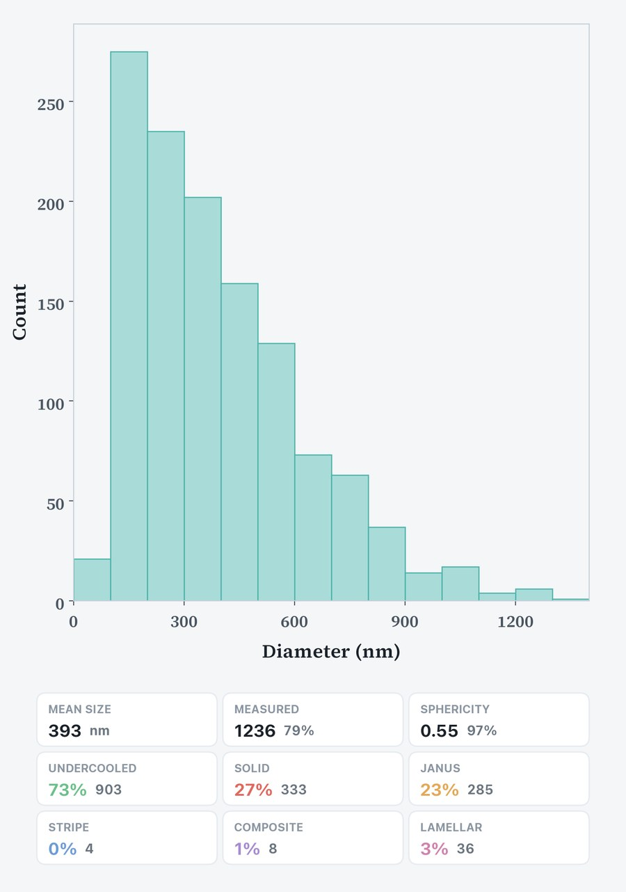
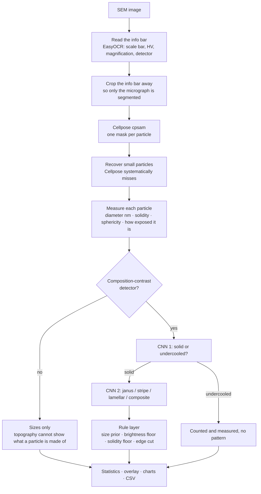

# SEM Particle Analyzer

Measures every particle in an SEM micrograph and classifies what it is — in one
click, on a laptop, offline.



*One image, 1558 particles found: each one measured, sorted into solid vs.
undercooled, and the solid ones coloured by their internal pattern. The scale
came from the image's own info bar — nothing was calibrated by hand.*

The work this replaces was done particle by particle in ImageJ: set the scale,
trace a particle, read its diameter, decide by eye what it is, write it down.
An image like the one above is an afternoon that way, and no two people do it
the same. Here it is one button and a few seconds, and the rules are the same
every time.

---

> ### ⚠️ This is trained for ONE material system
>
> Both networks were trained on **BiSn (bismuth–tin) colloidal particles**,
> imaged on two specific scanning electron microscopes. On anything else —
> different material, different preparation, a very different instrument — the
> app will still happily produce numbers, and those numbers will be **wrong
> without saying so**. There is no "unknown" answer: a classifier only knows the
> classes it was shown.
>
> The **size measurement** is more portable than the classification (it is
> geometry plus the scale bar, not a learned prior), but it too depends on
> Cellpose finding particles that look like these.
>
> If you want it for your own system, that is what **Training mode** is for —
> label your own particles and retrain the pattern network on them.

---

## What it does

- **Finds every particle** in the image (Cellpose `cpsam`), including the small
  ones a single segmentation pass misses.
- **Measures each one** — equivalent-circle diameter in nanometres, plus
  solidity, sphericity and how much of it is cut off by the frame or buried
  under a neighbour.
- **Reads the scale itself** from the microscope's info bar (OCR), so no manual
  calibration and no "which magnification was this again?".
- **Classifies each particle** as *solid* (crystalline) or *undercooled*, and
  each solid one by its internal pattern: **Janus**, **Stripe**, **Lamellar**,
  **Composite**.
- **Refuses to measure what it can't see.** A particle mostly hidden behind
  another is counted but kept out of the size statistics, because its visible
  outline under-reports its true diameter.
- **Reports and exports** — size histogram, composition breakdown, per-particle
  CSV, the labelled overlay as a PNG.


- **Learns from you.** Training mode lets you correct particles by clicking them
  and retrain the pattern network on your own labels, in the app.

Everything runs locally. After the first launch it needs no internet at all.

## How it works



Two details that matter more than they look:

**The scale comes from the picture.** Every microscope stamps a bar and a
length ("5 µm") into the image. Reading that is what makes an analysis
reproducible across magnifications and across instruments — and what removes
the single most common source of silent error in manual work, which is a scale
set once and then forgotten as the magnification changes.

**Patterns are only read where they are real.** Composition (Z) contrast is what
makes a Janus particle's two halves visible; a topographic detector cannot show
it. So the app checks which detector took the image and reports **sizes only**
when the answer would be a guess, instead of guessing.

## How accurate it is

Scored on a **golden set**: 8 photographs, **5314 hand-labelled particles**,
from **two different microscopes**. These photos have never been in the training
set — the code refuses to score a model on a photo it trained on, and reports
the conflict rather than quietly producing a flattering number.

The score is measured on the app's **real output**, not on the network's raw
argmax: the solid/undercooled gate, the size prior and every rule on top of the
network all run, because a pattern the pipeline never lets through is not a
pattern the user ever sees.

| | measured particles (n = 4614) |
|---|---|
| **Overall accuracy** (5 classes) | **86.2 %** |
| **Macro-F1** (5 classes) | **0.805** |
| Solid vs. undercooled, on its own | 91.2 % |

Per class, F1: **janus 0.77 · stripe 0.72 · lamellar 0.82 · composite 0.79 ·
no pattern 0.92**.

By instrument: 85.8 % on the first microscope (n = 3489), 87.4 % on the second
(n = 1125) — the second one was added later, and keeping the older data working
while it came in was most of the difficulty.

**What "measured particles" means.** 4614 of the 5314 labelled particles clear
the exposure gate; the rest are too buried or too clipped for their diameter to
be honest, so the app counts them but leaves them out of the statistics. Scored
over *all* labelled particles instead, the same model gets 84.1 % / macro-F1
0.776 — that number is stored next to the headline one in the app so the gap
stays visible rather than being quietly chosen.

**Where the errors are.** Mostly at the solid/undercooled gate, not in the
pattern network: a patterned particle that the gate calls undercooled never
reaches the pattern classifier at all. Stripe is the weakest class (recall
0.65), and composite is the rarest in training (644 crops vs. 4547 for janus).

## Download and run

**macOS (Apple Silicon) — no Python, no terminal:** take the zip from
[**Releases**](https://github.com/EfeUtku0/SEM-Particle-Analyzer/releases/latest),
unzip it, drag the app into Applications, and on the **first launch right-click
it → Open → Open** (a plain double-click gets refused: the app is unsigned).
Everything it needs is inside the bundle, including the models — it never asks
for the internet.

**Anywhere else — from source.** You need **Python 3.11–3.13** and about **6 GB
of free disk**:

```bash
git clone https://github.com/EfeUtku0/SEM-Particle-Analyzer.git
cd SEM-Particle-Analyzer
python3 -m venv .venv
.venv/bin/pip install -r requirements.txt      # Windows: .venv\Scripts\pip
.venv/bin/python app/gui.py                    # Windows: .venv\Scripts\python app\gui.py
```

Afterwards just double-click **`run.command`** (macOS) or **`run.bat`**
(Windows). Run from source and **the first analysis downloads ~1.3 GB** of model
weights (Cellpose `cpsam`, EasyOCR) into your home folder, once — the packaged
build has them already. Either way the first analysis takes a minute or two
while PyTorch warms up; every one after that takes seconds.

| | status |
|---|---|
| macOS, Apple Silicon (M1–M4) | tested — GPU (MPS) accelerated |
| macOS, Intel | not supported: PyTorch no longer ships wheels for it |
| Windows / Linux, x86-64 | should work from source; Cellpose falls back to the CPU without an NVIDIA card, which makes the first pass slow but correct |

There is no prebuilt Windows or Intel-Mac download: PyInstaller does not
cross-compile, so each one has to be built on the platform it runs on (see
*Building a distributable app* below).

### Türkçe kısa kılavuz

**Mac kullanıyorsan (M1–M4) kod bilmene gerek yok:** yukarıdaki
[Releases](https://github.com/EfeUtku0/SEM-Particle-Analyzer/releases/latest)
bağlantısından zip'i indir, çift tıkla, çıkan uygulamayı Applications'a sürükle.
**İlk açılışta çift tıklama — sağ tık → Aç → Aç de.** (Çift tıklarsan macOS
"açılamıyor" der; uygulama bozuk değil, imzasız olduğu için böyle davranıyor.
Bunu bir kez yapman yeterli.) Uygulama 8 örnek fotoğrafla açılır, birine
**Analyze** demen yeter.

**İlk analiz 1-2 dakika sürer** (model ısınıyor), sonrakiler saniyeler. Paketli
sürüm internet istemez; kaynaktan kurarsan ilk analizde ~1,3 GB model iner.

Uygulama **BiSn parçacıkları** için eğitildi; başka bir malzemenin fotoğrafını
verirsen sana yine bir sayı üretir ama o sayı yanlıştır. Kendi malzemen için
kullanmak istersen **Training** modundan kendi etiketlerinle yeniden eğitmen
gerekir.

## The first launch

The app starts with a folder of **eight example micrographs** already in the
library — the same BiSn particles it was trained for. Press **Analyze** on one
of them to see what the tool actually does before pointing it at your own data.

| example | what it shows | particles found | mean size |
|---|---|---|---|
| 1 · janus | mostly Janus particles — one bright half, one dark | 568 | 485 nm |
| 2 · stripe | Stripe, and at a **different magnification** (6.7 nm/px vs 13.4) so you can watch the scale being read | 289 | 469 nm |
| 3 · lamellar | Lamellar, with Janus and Composite mixed in | 993 | 535 nm |
| 4 · lamellar | Lamellar from a different sample | 655 | 591 nm |
| 5 · mixed | all four patterns plus undercooled | 469 | 832 nm |
| 6 · mixed | the same, more crowded | 721 | 626 nm |
| 7 · undercooled | almost nothing crystalline: 3238 particles, 17 solid — what "no pattern" looks like | 3238 | 177 nm |
| 8 · large particles | the coarse end of the size range | 298 | 980 nm |

(Counts and sizes are what this build produces on these files, so they double as
a check that your install is behaving.)

The files are copied into your data folder on first launch, so deleting them is
a normal library delete and they do not come back.

## Training mode

🎓 **Training** lets you click particles, give them the right class, and retrain
the pattern network on what you marked.

It is entirely local: your labels go to a `SEM Eğitim` folder (Desktop on macOS,
Documents elsewhere) and the retrained model to your own data folder. Nobody
else's copy is affected.

⚠️ **A retrained model replaces the one that ships with the app.** The bundled
one was trained on 8185 hand-labelled particles across 53 photographs; retrain
on a handful of your own and the results get *worse* for reasons that will not
be obvious. Retrain when you have labelled seriously. To go back to the bundled
model, delete `patternnet.pt` from the data folder below.

After every training run the app scores the new model against the golden set and
shows you the confusion matrix, the per-class recalls and how this run compares
with the previous ones — so "did that help?" is answered with a number, not a
feeling.

## Where your data lives

Your folder tree, your analyses and any model you retrained live **outside** the
app, so updating or replacing it never touches them:

| OS | folder |
|---|---|
| macOS | `~/Library/Application Support/SEM Particle Analyzer` |
| Windows | `%APPDATA%\SEM Particle Analyzer` |
| Linux | `~/.local/share/SEM Particle Analyzer` |

**Your images are never moved, renamed or deleted.** The library only remembers
where they are; its folders are virtual, so dragging an image between them
changes nothing on disk.

Deleting is always deliberate (right-click → Remove, or the Delete key; folders
ask first). Three automatic backups sit next to `library.json` anyway:
`library.json.bak` (before the last change), `library.startup.json` (as it was
when you opened the app) and `library.shrink.json` (before the image count last
dropped). To restore one: quit the app, rename the backup to `library.json`,
start again.

## Building a distributable app

PyInstaller does not cross-compile — build on the platform you are targeting:

```bash
.venv/bin/pyinstaller --noconfirm --clean sem_analyzer.spec
```

- macOS → `dist/SEM Particle Analyzer.app`, zip it with
  `ditto -c -k --keepParent "dist/SEM Particle Analyzer.app" app-macos.zip`
- Windows → `dist/SEM Particle Analyzer/`, zip the whole folder

The build embeds the Cellpose and EasyOCR weights from `~/.cellpose` and
`~/.EasyOCR`, so the packaged app needs no downloads. If the spec prints
`WARNING: ... weights not found`, run one analysis from source first, then
rebuild.

Check a build without opening a window:

```bash
SEMPA_SELFTEST=/path/to/image.jpeg "dist/SEM Particle Analyzer.app/Contents/MacOS/SEM Particle Analyzer"
```

## Known limits

- **One material system** (see the warning at the top).
- **Patterns need a composition-contrast detector.** On a topographic image the
  app reports sizes only, by design.
- **Touching particles** are separated by Cellpose, and it does not always get
  clusters right; the app hides badly-buried particles from the statistics
  rather than pretending to measure them.
- **Stripe is the weakest class**, and **composite the rarest** in training.
- **Adding more of the same photographs stopped helping** around 50 photographs
  — the measured accuracy has been flat since, so the remaining error is not
  something more of the same data fixes.

## Built with

Python · PyTorch · [Cellpose](https://github.com/MouseLand/cellpose) ·
EasyOCR · OpenCV · scikit-image · PySide6 (Qt) · matplotlib · PyInstaller

## License

MIT — see [LICENSE](LICENSE).
